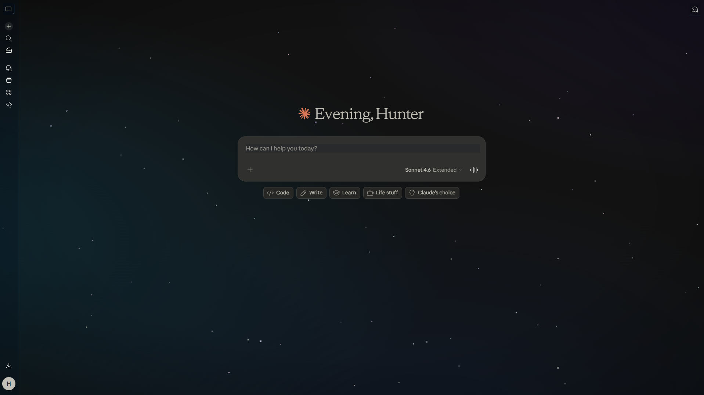

# Nebula for Claude

A deep-space ambient atmosphere for [claude.ai](https://claude.ai) — animated starfield backgrounds, glassmorphism panels, and focus tools. Built for the aesthetic, zero bloat.



---

## Features

- **Animated nebula background** — slow-drifting gradient layers, no external images
- **Star field** — 480 deterministic stars (stable across reloads, no flickering)
- **Glassmorphism panels** — sidebar, header, input, modals all go frosted-glass
- **4 themes** — Void (cyan), Nebula (purple), Neon (vivid cyan), Mono (slate)
- **Focus mode** — hides conversation history until you hover the sidebar
- **Glow accents** — subtle neon glow on interactive elements
- **Grid lines** — optional HUD overlay
- **Panel opacity + blur sliders** — dial in exactly how much you want
- **Animation speed** — Slow / Medium / Off
- **SPA-aware** — survives Next.js navigation without breaking
- **Private** — no network calls, no analytics; settings sync via `chrome.storage.sync`

---

## Install

### Option A — Download zip (easiest)

1. Download **[nebula-for-claude-v1.0.0.zip](https://github.com/Python840/nebula-for-claude-/raw/main/nebula-for-claude-v1.0.0.zip)**
2. Extract the zip anywhere
3. Open Chrome → `chrome://extensions`
4. Enable **Developer mode** (top right)
5. Click **Load unpacked** → select the extracted folder
6. Pin from the puzzle icon → open [claude.ai](https://claude.ai)

### Option B — Clone

```bash
git clone https://github.com/Python840/nebula-for-claude-.git
```
Then follow steps 3–6 above.

Chrome Web Store release planned.

---

## Themes

| Name   | Base       | Accent       | Vibe                        |
|--------|------------|--------------|-----------------------------|
| Void   | `#020817`  | cyan         | Deep space, Nano City       |
| Nebula | `#05020f`  | purple       | Galactic, atmospheric       |
| Neon   | `#010a10`  | vivid cyan   | Electric, high-contrast     |
| Mono   | `#0a0a0f`  | indigo       | Minimal, clean              |

---

## Permissions

```json
"permissions": ["storage"],
"host_permissions": ["https://claude.ai/*"]
```

- **storage** — remembers your settings across sessions
- **host_permissions** — runs only on claude.ai

No data leaves your machine.

---

## How it works

- Injects a fixed `<div id="nebula-bg">` behind claude.ai's `#__next` container
- Adds CSS classes to `<html>` to trigger glassmorphism on structural elements
- Star field is generated via a deterministic LCG sequence (seeded, not random) — same stars every load
- Patches `history.pushState` / `replaceState` to survive SPA navigation
- All settings stored in `chrome.storage.sync` — syncs across devices

---

## License

MIT — do anything, keep the notice.

---

*Maintained with Claude.*
